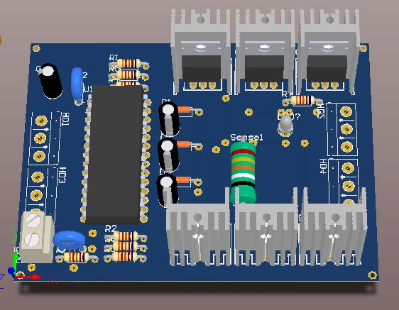
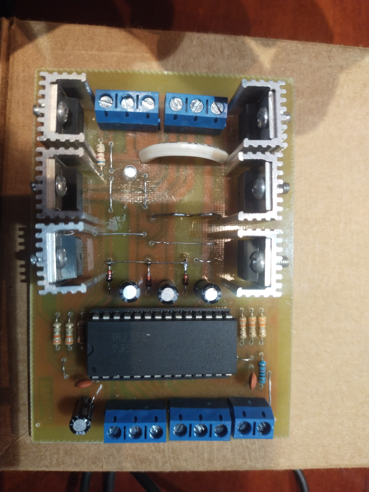
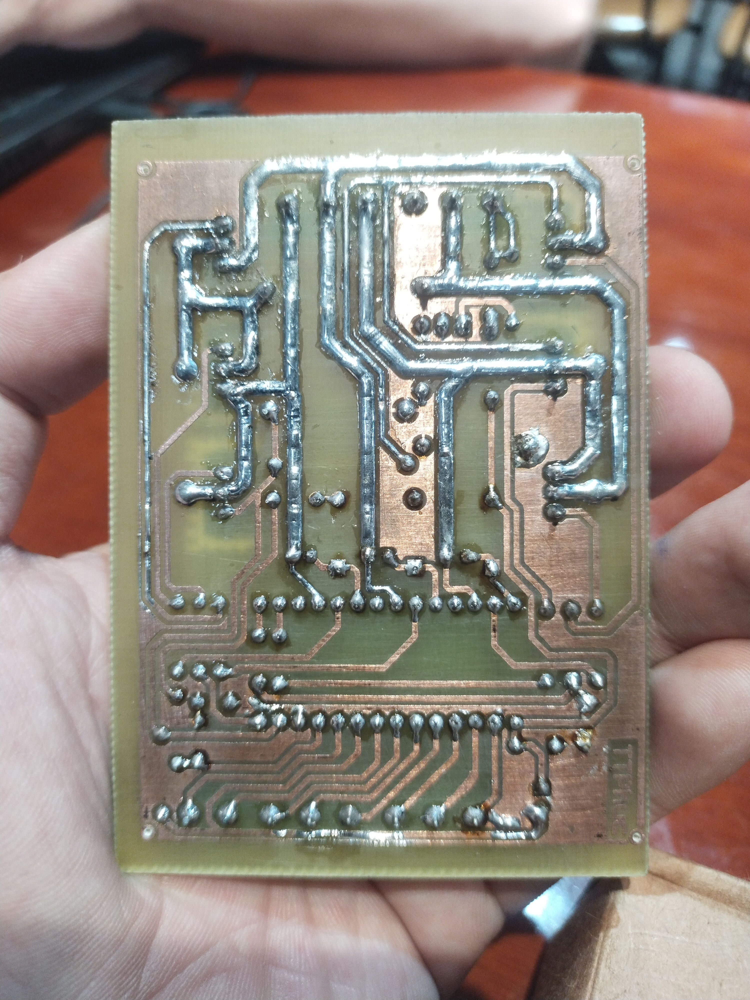
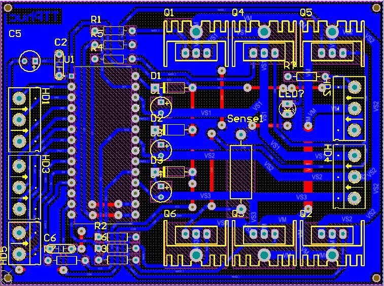

# 📌 High-Power Motor Driver Using IR2136 & IRFZ44  

## 📖 Introduction  
This repository contains the schematic and PCB design for a three-phase motor driver circuit using the **IR2136 driver IC** and **IRFZ44 MOSFETs**. The circuit includes fault protection, enable control, and current sensing features.  

## 🚀 Key Features  
✔️ **Three-phase motor control** using IR2136  
✔️ **Six IRFZ44 MOSFETs** ensuring high power output  
✔️ **Overcurrent protection** via a **0.05 Ohm** shunt resistor  
✔️ **FAULT & EN outputs** for system protection  
✔️ **Bootstrap capacitors** to drive high-side MOSFETs  
✔️ **Header interface** for MCU or external control circuits  

## 🛠 Schematic Overview  
The circuit consists of the following main components:  
- **IR2136 (U1)** – Controls six MOSFETs (Q1 - Q6)  
- **IRFZ44 MOSFETs** – High-power switching, max current **49A**, max voltage **55V**  
- **Bootstrap circuit** – Capacitors (`C1, C3, C4`) & diodes (`D1, D2, D3`) to support high-side MOSFETs  
- **Diode 1N4118** – Protects against voltage spikes  
- **Resistors & Capacitors** – Noise filtering and circuit stabilization  
- **Control inputs (HIN, LIN, FAULT, EN)** – MCU-compatible interface  
- **Power supply (VCC, VM, GND)** – Provides power for the system  
- Schematic: 

## 🔌 Pinout & Connections  
| Pin | Function |  
|------|----------|  
| **HIN1, HIN2, HIN3** | High-side MOSFET control |  
| **LIN1, LIN2, LIN3** | Low-side MOSFET control |  
| **FAULT** | Fault detection output |  
| **EN** | Enable input |  
| **VCC** | Logic power supply |  
| **VM** | Motor power supply |  
| **VS1, VS2, VS3** | Motor phase voltage |  
| **HO1, HO2, HO3** | High-side MOSFET drive output |  
| **LO1, LO2, LO3** | Low-side MOSFET drive output |  

## 🖥 PCB Design  
📌 **Optimized layout** for high performance:  
✅ **Thick copper traces** for high current flow  
✅ **Proper spacing** to prevent short circuits  
✅ **Optimized component placement** for heat dissipation  

## 🖼️ PCB Design Images  
### 🔹 PCB View  
  

### 🔹 PCB Layout  
  

## 🎯 Usage Instructions  
1️⃣ Provide **VCC (logic)** & **VM (motor power)**  
2️⃣ Connect **HIN, LIN, EN, FAULT** to the MCU  
3️⃣ Connect the motor phases to **VS1, VS2, VS3**  
4️⃣ Monitor MOSFET temperature, add a **heatsink if necessary**  
5️⃣ Program the MCU to send **PWM signals** to control motor speed  

## 🎯 Video Demo

## 🔄 Future Improvements  
⚡ **Integrate current sensing** → Enable closed-loop control  
⚡ **Reverse polarity protection** → Prevent component damage  
⚡ **Optimize PCB layout** → Reduce noise and enhance durability  

---

📜 License
🚀 Open-source project – Free to use for educational & commercial purposes

Created by Trần Trọng Phúc
📧 Contact: trantrongphucttp27@gmail.com

---

🔥 If you find this project useful, don't forget to **⭐ Star** the repo!  
